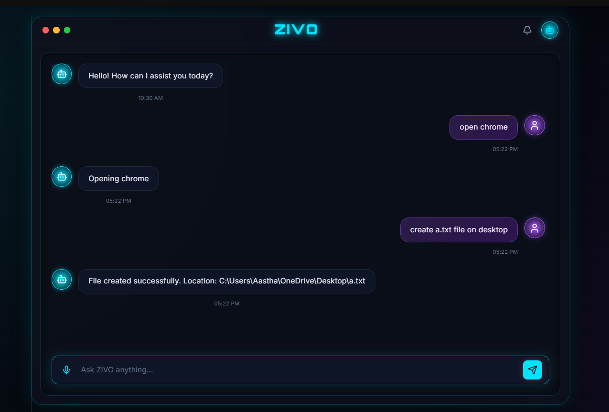

# Zivo

Zivo is a small Windows-focused CLI assistant that uses Gemini to understand simple natural-language requests and turn them into actions.

It currently supports:

- Opening applications such as Chrome, Calculator, Notepad, Paint, Command Prompt, and File Explorer
- Creating files in Desktop, Documents, or Downloads
- Creating folders in Desktop, Documents, or Downloads

## Requirements

- Windows
- Python 3.10+
- A Gemini API key

## Setup

1. Open a terminal in the repository root.
2. Create and activate a virtual environment if you want one.
3. Install dependencies:

```bash
pip install -r backend/requirements.txt
```

4. Add your Gemini API key to an environment file named `.env` inside `backend/`:

```env
GEMINI_API_KEY=your_api_key_here
```

## Run

Start the CLI from the `Backend` folder:

```bash
cd backend
python -m uvicorn main:app --host 127.0.0.1 --port 8000
```
Start the CLI from the `Frontend` folder:

```bash
cd frontend
npm run dev
```

The app will prompt for a command and print the parsed Gemini output before executing the requested action.

## Examples

- `Open Chrome`
- `Create app.py on desktop`
- `Create Project folder in documents`


#### Voice Interaction / How it works 

- Added browser-based Speech Recognition.
- Clicking the microphone starts voice listening.
- The UI displays `Listening...` while ZIVO is listening.
- Voice waveform animation appears only when the microphone is active.
- After speech is recognized, the command is automatically sent to the backend.
- Added processing state with `ZIVO is thinking...`.

1. `open_application`
2. `create_file`
3. `create_folder`

The command handler then routes that JSON to the matching tool in `backend/tools/`.

## 📁 Project Structure

```text
ZIVO/
│
├── backend/
│   ├── agent/
│   │   ├── __init__.py            # Makes agent a Python package
│   │   ├── brain.py               # Gemini-based command understanding
│   │   ├── command_handler.py     # Routes commands to tools
│   │   ├── local_parser.py        # Local command parsing
│   │   └── prompt.py              # Gemini system prompt
│   │
│   ├── tools/
│   │   ├── __init__.py            # Makes tools a Python package
│   │   ├── app_finder.py          # Finds installed applications
│   │   ├── app_tools.py           # Opens Windows applications
│   │   └── file_tools.py          # Creates files and folders
│   │
│   ├── utils/
│   │   ├── __init__.py            # Makes utils a Python package
│   │   ├── fuzzy_match.py         # Fuzzy matching utilities
│   │   └── gemini_client.py       # Gemini API client
│   │
│   ├── .env                       # Environment variables (not committed)
│   ├── .gitignore                 # Backend Git ignore rules
│   ├── main.py                    # FastAPI backend entry point
│   └── requirements.txt           # Python dependencies
│
├── frontend/
│   ├── public/                    # Public assets
│   │
│   ├── src/
│   │   ├── assets/                # Static assets
│   │   ├── components/
│   │   │   └── VoiceButton.jsx    # Voice capture component
│   │   ├── api.ts                 # Frontend ↔ FastAPI communication
│   │   ├── App.css                # ZIVO voice UI styling
│   │   ├── App.tsx                # Main React application shell
│   │   ├── index.css              # Global CSS styles
│   │   └── main.tsx               # React DOM rendering entry
│   │
│   ├── .gitignore                 # Frontend Git ignore rules
│   ├── index.html                 # Main HTML template
│   ├── package.json               # Node dependencies and scripts
│   ├── package-lock.json          # Locked dependency versions
│   ├── README.md                  # Frontend documentation
│   ├── tsconfig.app.json          # TypeScript app configuration
│   ├── tsconfig.json              # TypeScript configuration
│   ├── tsconfig.node.json         # Node/Vite TypeScript configuration
│   └── vite.config.ts             # Vite build configuration
│
├── .gitignore                     # Root Git ignore rules
└── README.md                      # Main ZIVO documentation
```
## 📸 Dashboard

<p align="center">
  
</p>

## Notes

- File and folder creation currently targets Desktop, Documents, and Downloads, including common OneDrive locations.
- Application launching is Windows-specific because it relies on Windows shell commands and shortcuts.
- If Gemini returns invalid JSON, the current CLI will fail while parsing the response.
